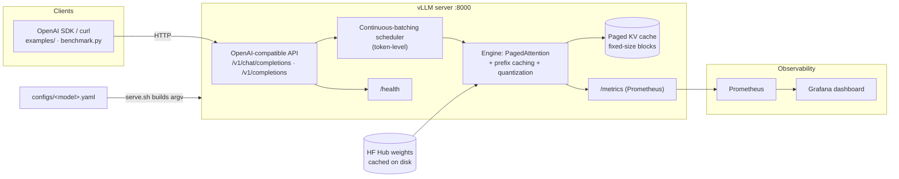
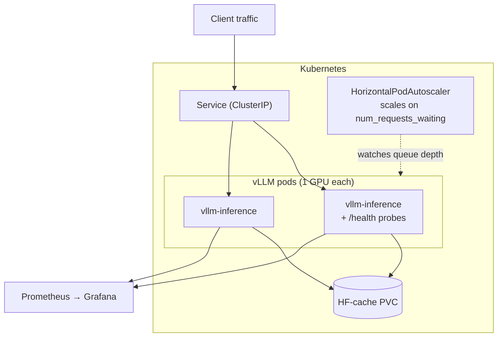

# llm-inference

Production-ready LLM inference serving — the way the big labs and products do it.

This repo is a batteries-included template for **hosting any open-weight LLM** behind a fast,
OpenAI-compatible HTTP API using [vLLM](https://github.com/vllm-project/vllm). It bundles the
serving engine, configuration, containerization, Kubernetes manifests, autoscaling, observability
(Prometheus + Grafana), a thin client SDK, benchmarking, and worked examples.

> Serve `Qwen/Qwen3-0.6B`, `meta-llama/Llama-3.1-8B-Instruct`, a GPTQ/AWQ quantized checkpoint,
> or your own fine-tune — same workflow, one config file.

---

## Architecture

A model config drives the engine; clients speak the OpenAI API; Prometheus + Grafana watch it.



**Deployment topology** — the same image runs under Compose locally or Kubernetes in production:



The request path (`client → API → scheduler → PagedAttention → KV cache`) is what makes the
serving optimizations in the table below concrete.

---

## Why vLLM

| Feature | Benefit |
| --- | --- |
| **Continuous batching** | Token-level scheduling — no wasted compute waiting on the longest request |
| **PagedAttention** | KV cache in fixed-size blocks — near-zero memory waste, no fragmentation |
| **Prefix caching** | Reuses KV cache for shared prompt prefixes across requests |
| **Quantization** | Natively serves GPTQ, AWQ, FP8, and compressed-tensors checkpoints |
| **OpenAI-compatible API** | Drop-in replacement for anything already using the OpenAI client |

---

## Quickstart

### 1. Install

This repo uses [uv](https://docs.astral.sh/uv/). The pinned interpreter is in `.python-version`
(3.12 — vLLM has no wheels for 3.13+), so uv fetches/uses the right Python automatically even if
your system Python is newer.

```bash
# Local dev (client, config, examples, tests) — works on macOS/Linux/Windows:
uv sync --extra dev

# Where you actually run the engine (Linux + GPU): also pull in vLLM:
uv sync --extra dev --extra serve
```

Run anything inside the env with `uv run` (e.g. `uv run examples/01_quickstart.py`) — no manual
activation needed. Prefer plain pip? `pip install -e ".[dev,serve]"` still works.

### 2. Serve a model

```bash
# Convenience wrapper around `vllm serve` driven by configs/
./scripts/serve.sh qwen3-0.6b

# ...which is equivalent to:
vllm serve Qwen/Qwen3-0.6B --dtype bfloat16 --max-model-len 4096 --port 8000
```

The server exposes the OpenAI routes (`/v1/models`, `/v1/chat/completions`, `/v1/completions`,
`/v1/embeddings`) plus a Prometheus `/metrics` endpoint and a `/health` probe.

### 3. Query it

```bash
uv run examples/01_quickstart.py
```

```python
from openai import OpenAI

client = OpenAI(base_url="http://localhost:8000/v1", api_key="unused")
resp = client.chat.completions.create(
    model="Qwen/Qwen3-0.6B",
    messages=[{"role": "user", "content": "What is PagedAttention in one sentence?"}],
    max_tokens=80,
    extra_body={"chat_template_kwargs": {"enable_thinking": False}},
)
print(resp.choices[0].message.content)
```

---

## Run the full stack (Docker Compose)

Brings up vLLM + Prometheus + Grafana with one command:

```bash
cd docker
docker compose up        # vLLM :8000 · Prometheus :9090 · Grafana :3000
```

Grafana ships with a pre-wired dashboard for the key serving metrics
(running/waiting requests, KV cache usage, throughput, TTFT, latency).

> **GPU note:** the Docker image targets CUDA. On a CPU-only box, serve a small unquantized
> model (e.g. `Qwen3-0.6B`) directly with `./scripts/serve.sh`; quantized W4A16 formats only
> have optimized runtime support on GPUs.

---

## Examples

| Script | Demonstrates |
| --- | --- |
| `examples/01_quickstart.py` | First chat completion via the OpenAI client |
| `examples/02_logprobs.py` | Token-level logprobs & sampling parameters |
| `examples/03_continuous_batching.py` | Concurrent requests + live `/metrics` |
| `examples/04_prefix_caching.py` | Shared system prompt reusing cached KV blocks |
| `examples/05_thinking_mode.py` | Qwen3 chain-of-thought streaming, on vs off |

---

## Validate & test (no GPU required)

vLLM itself needs a Linux GPU, but you can validate the *whole repo* — client, metrics scraper,
streaming, and all the examples — on any machine. The test suite ships a small stdlib
**OpenAI-compatible mock server** (`tests/mock_server.py`); `conftest.py` uses a real vLLM server
on `:8000` if one is running, otherwise spins up the mock automatically.

```bash
make test          # 9 tests, runs end-to-end against the mock — no GPU, no skips
make demo-local    # start the mock, run quickstart + batching + prefix-caching, stop it
make mock          # just run the mock on :8000 to poke at by hand
```

What this proves vs. what it doesn't:

- ✅ **Validated locally / in CI:** the OpenAI client integration, metrics parsing, streaming/SSE,
  logprobs handling, prefix-cache accounting, and every example's control flow.
- 🖥️ **Needs a real GPU:** actual generation quality and performance — those are properties of the
  vLLM engine, demonstrated on a GPU (see the one-click Colab demo below).

### Try the real engine — one-click Colab demo (free T4 GPU)

[](https://colab.research.google.com/github/giannisp09/llm-inference/blob/main/examples/colab_demo.ipynb)

Opens a notebook that installs vLLM, serves `Qwen/Qwen3-0.6B` on Colab's free GPU, and runs the
quickstart, continuous-batching, prefix-caching, and metrics demos against the **real** engine.

---

## Deploy to Kubernetes

```bash
kubectl apply -f deploy/k8s/
```

Includes a GPU `Deployment`, `Service`, `HorizontalPodAutoscaler` (scales on a custom
`num_requests_waiting` metric), `ServiceMonitor`, and readiness/liveness probes wired to
`/health`. See [`deploy/README.md`](deploy/README.md).

---

## Benchmark

```bash
python scripts/benchmark.py --url http://localhost:8000 --concurrency 32 --num-requests 256
```

Reports throughput (tokens/s), TTFT (time-to-first-token), and end-to-end latency percentiles.

---

## Repository layout

```
llm-inference/
├── configs/              # one YAML per servable model (engine + sampling defaults)
├── src/llm_inference/    # thin Python package: config loader, client, metrics scraper
├── scripts/              # serve.sh, download_model.py, benchmark.py
├── examples/             # runnable demos (quickstart → batching → prefix caching)
├── docker/               # Dockerfile + docker-compose (vLLM + Prometheus + Grafana)
├── deploy/               # Kubernetes manifests, HPA, monitoring config
└── tests/                # smoke + client tests
```

## Configuration

Each model is described by a YAML file in `configs/`. Add a new model by dropping in a file:

```yaml
# configs/llama3-8b.yaml
model: meta-llama/Llama-3.1-8B-Instruct
served_model_name: llama3-8b
engine:
  dtype: bfloat16
  max_model_len: 8192
  gpu_memory_utilization: 0.90
  tensor_parallel_size: 1
  enable_prefix_caching: true
sampling:
  temperature: 0.7
  top_p: 0.8
  top_k: 20
```

Then: `./scripts/serve.sh llama3-8b`.

## License

Apache-2.0 — see [LICENSE](LICENSE).
